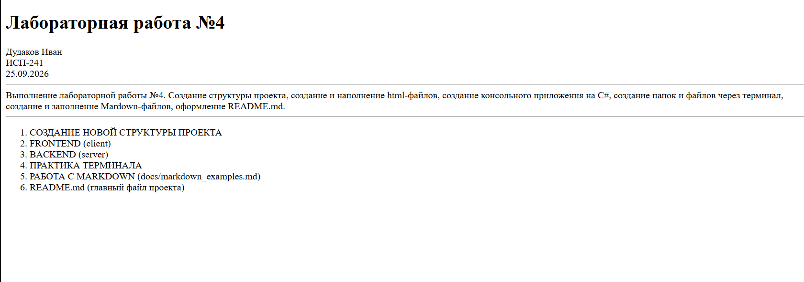

## **Заголовки** 
# Заголовок 1
## Заголовок 2
### Заголовок 3
#### Заголовок 4
##### Заголовок 5
###### Заголовок 6
---

## **Форматирование текста**
* **жирный**
* *курсив*
* ~~зачёркнутый~~
* ***моноширный***
---

## Списки
Маркированный:
* Пункт
* Пункт

Нумерованный:
1. Первый пункт
2. Второй пункт
3. Третий пункт

Вложенный:
* Пункт
    * Подпункт
* Пункт
    * Подпункт
---

## Цитаты
>Это цитата
>>Это вложенная цитата
---

## Блоки кода
inline-код: `git status`
блок-код:
```csharp
System.Console.WriteLine("Здравствуйте, это консольное приложение созданное в рамках лабораторной работы №4");
while (flag)
{
    System.Console.WriteLine("Меню: \n 1 - Показать ФИО \n 2 - Показать группу \n 3 - Показать дату \n 4 - Выход");
    int choice = int.Parse(Console.ReadLine());
    
    switch (choice) 
    {
        case 1:
            System.Console.WriteLine($"ФИО: {name} {surname}");
            Console.ReadKey();
            break;
        case 2:
            System.Console.WriteLine($"Группа: {group}");
            Console.ReadKey();
            break;
        case 3:
            System.Console.WriteLine($"Дата и время: {data}, {time}");
            Console.ReadKey();
            break;
        case 4:
            System.Console.WriteLine($"Вы вышли из программы");
            flag = false;
            break;
        default:
            System.Console.WriteLine("Такой команды нет");
            Console.ReadKey();
            break;
    }
}
```
---

## Таблица
|Тип данных|Системное название|Значения|
|:--------:|:----------------:|:-------|
|bool|Boolean|true/false|
|byte|Byte|0 - 255|
|sbyte|SByte|-128 - 127|
|short|Int16|-32768 - 32767|
|ushort|UInt16|0 - 65535|
|int|Int32|-2147483648 - 2147483647|
|uint|UInt32|0 - 4294967295|
|long|Int64|–9223372036854775808 - 9223372036854775807|
|ulong|UInt64|0 - 18446744073709551615|
|float|Single|$-3.4*10^{38}$ - $3.4*10^{38}$|
|double|Double|$\pm5.0*10^{-324}$ - $\pm1.7*10^{308}$|
|decimal|Decimal|$\pm1.0*10^{-28}$ - $\pm7.9228*10^{28}$|
|char|Char|Одиночный символ|
|string|String|Строка|
|object|Object|Значение любого типа данных|
---

## Картинка


---

## Ссылки
Внешняя: [Mardown Guide](https://www.markdownguide.org/)
Внутренняя: [Начало документа](#заголовки)

---

## Чекбоксы
- [ ] Практика по C#
- [x] Практика по Dart

---

## Alert-блоки GitHub
>[!NOTE]
Заметка

>[!WARNING]
Предупреждение

---

## Inline LaTeX
$a^2 + B^2 = c^2$

---

## Block LaTeX
$$
\sum_{i=1}^n i = \frac{n(n+1)}{2}
$$

